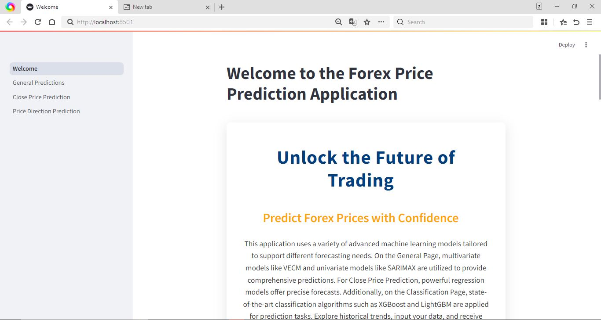
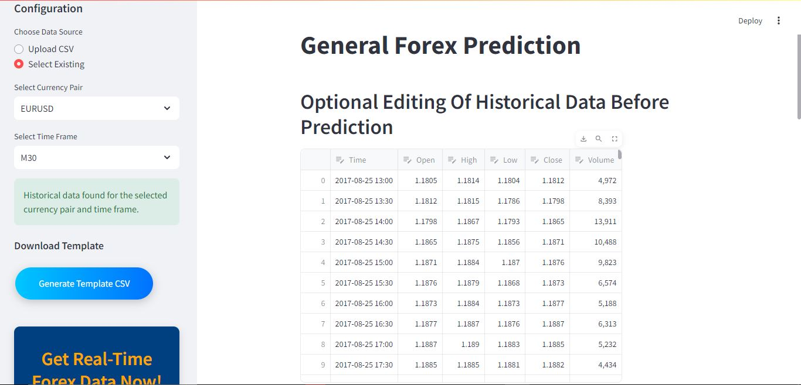
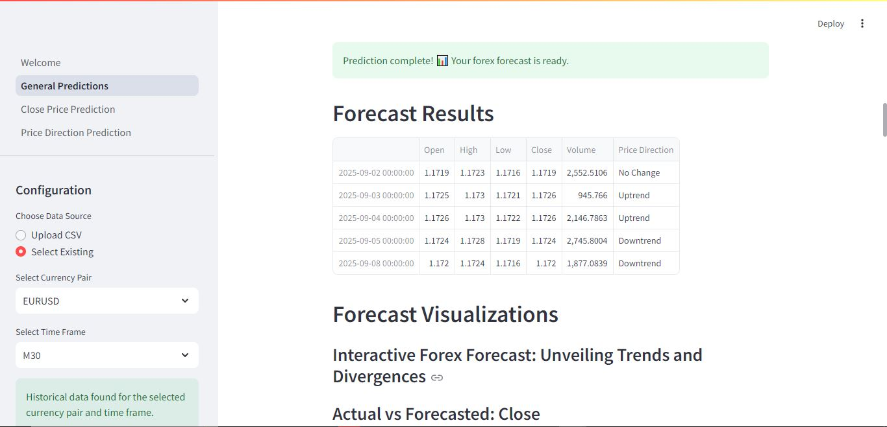
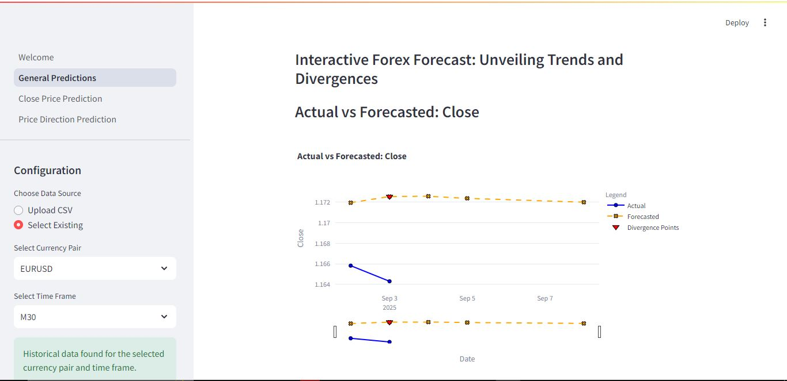
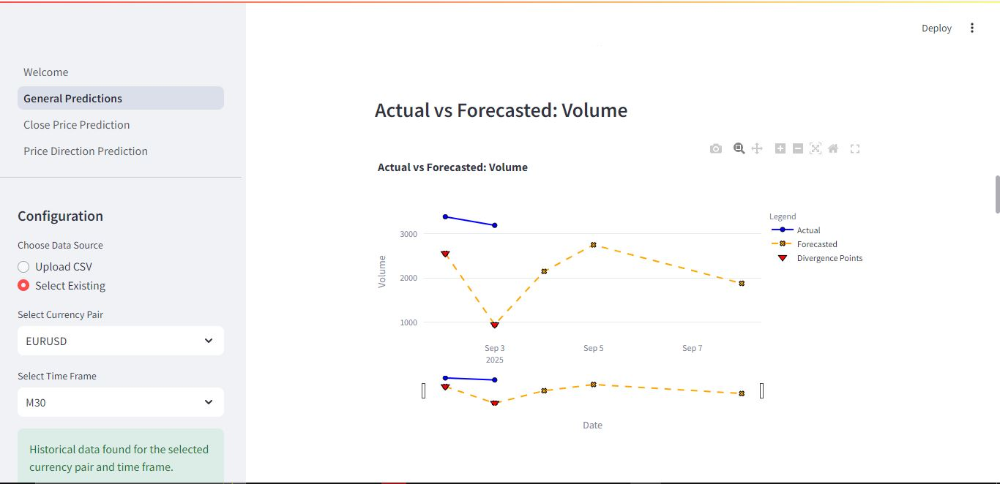
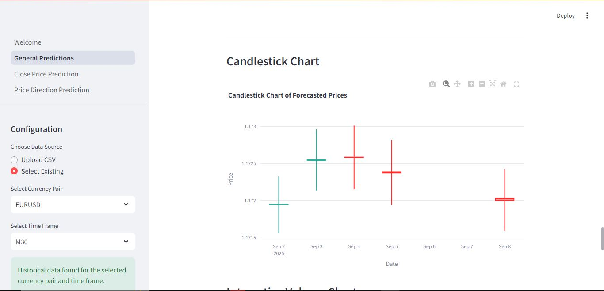

# ML_Forex_Prediction_App

  
*Caption: Main interface of the ML Forex Prediction App showcasing the interactive prediction dashboard.*

## Overview

The **ML_Forex_Prediction_App** is a machine learning-powered web application designed for forecasting forex market trends, specifically for the EURUSD currency pair. Built using Python and Streamlit, the app provides four primary prediction functionalities: **Close Price Prediction (Linear Regression/XGBoost)**, **Close Price Prediction (VECM)**, **Price Direction Prediction**, and **General Forex Prediction**. It leverages advanced machine learning and econometric models (Linear Regression, XGBoost, LightGBM, VAR, VECM, SARIMAX) with comprehensive feature engineering to deliver accurate and actionable insights for traders and analysts.

The app integrates historical forex data, performs advanced feature engineering, applies dimensionality reduction (PCA), and provides interactive visualizations such as candlestick charts, moving averages, Bollinger Bands, and RSI. It supports manual data uploads, pre-loaded datasets, and an automated data downloader for fetching real-time EURUSD data from [ForexSB](https://data.forexsb.com).

---

## Features

1. **Close Price Prediction (Linear Regression/XGBoost)** (`2_close_price_prediction.py`):
   - Predicts the closing price of EURUSD using Linear Regression and XGBoost models.
   - Features visualizations like candlestick charts with moving averages and feature engineering insights.
   - Allows user input for `Open`, `High`, `Low`, and `Volume`.

2. **Close Price Prediction (VECM)** (`Forex_ClosePrice_Prediction_vecm.py`):
   - Uses Vector Error Correction Model (VECM) for forecasting EURUSD closing prices.
   - Incorporates cointegration analysis (Johansen and Phillips-Hansen tests), Granger causality, and impulse-response analysis.
   - Visualizations include time series plots, candlestick charts, volume bars, histograms, box plots, and correlation heatmaps.
   - Features PCA for dimensionality reduction and VIF-based multicollinearity filtering.

3. **Price Direction Prediction** (`3_price_direction.py`):
   - Forecasts price direction (Up, Down, Neutral) using XGBoost and LightGBM models.
   - Includes visualizations like candlestick charts, Bollinger Bands, RSI, and correlation heatmaps.
   - Supports user-editable historical data.

4. **General Forex Prediction** (`General_predictions.py`):
   - Uses VECM and SARIMAX for multi-step forecasting of `Open`, `High`, `Low`, `Close`, and `Volume`.
   - Features interactive Plotly-based visualizations with candlestick charts and volume bars.
   - Supports customizable parameters like train-test split and seasonality.

5. **Automated Data Downloader** (`downloader.py`):
   - Fetches historical EURUSD data from [ForexSB](https://data.forexsb.com) for M30, H1, H4, and D1 timeframes.
   - Ensures data freshness with a 4-hour threshold.

6. **Data Preprocessing and Feature Engineering**:
   - Features include High-Low Range, Open-High Range, Open-Low Range, Rolling Volatility, True Range, SMA, EMA, RSI, MACD, Bollinger Bands, Momentum, Volume Change, and Lagged Features.
   - Applies VIF to remove multicollinear features and PCA for dimensionality reduction.
   - Handles non-stationarity via differencing for time-series modeling.

7. **Interactive Streamlit Interface**:
   - User-friendly interface with sidebar controls for data selection and parameter tuning.
   - Custom-styled visualizations with gradient effects and hover animations.
   - Downloadable template CSV for user data formatting.

8. **Evaluation Metrics**:
   - Provides MAE, MSE, RMSE, and MAPE for model performance.
   - Visualizes forecast accuracy with actual vs. predicted plots.

---

## Project Structure

```
ML_Forex_Prediction_App/
├── Historical Forex Data/    # Sample data (e.g., EURUSD_D1.csv)
├── datasets/                 # Downloaded and user-uploaded CSV files
├── model_Training/           # Scripts for training VAR, VECM, and other models
├── pages/                    # Streamlit page scripts
│   ├── 2_close_price_prediction.py
│   ├── 3_price_direction.py
├── predictionModels/         # Model APIs and prediction logic
│   ├── closepriceapi.py
│   ├── pricedirectionapi.py
│   ├── vecmapi.py
├── __pycache__/              # Python cache files
├── downloader.py             # Automated data downloader
├── Forex_ClosePrice_Prediction_vecm.py  # VECM-based close price prediction
├── General_predictions.py    # General forex prediction script
├── Welcome.py                # Streamlit app entry point
├── requirements.txt          # Python dependencies
├── packages.txt              # System package requirements
```

---

## Screenshots

1. **Data upload on the interface**  
     
   *Caption: Data upload either direct upload or selecting existing data*

2. **Forcast Results**  
     
   *Caption: Predictions on various features*

3. **Close Price Prediction (VECM)**  
     
   *Caption: VECM-based forecasting with cointegration analysis and visualizations.*

4. **Volume Forex Prediction Volume**  
     
   *Caption: Volume prediction over time.*

5. **Candlestick Chart Visualization**  
     
   *Caption: Candlestick chart with moving averages and volume.*


---

## Installation

### Prerequisites
- Python 3.8+
- Google Chrome (for `downloader.py`)
- Git

### Steps
1. **Clone the Repository**:
   ```bash
   git clone https://github.com/Airlectric/ML_Forex_Prediction_App.git
   cd ML_Forex_Prediction_App
   ```

2. **Install Dependencies**:
   ```bash
   pip install -r requirements.txt
   ```
   Install system packages (if needed):
   ```bash
   xargs sudo apt-get install < packages.txt
   ```

3. **Download Historical Data**:
   ```bash
   python downloader.py
   ```

4. **Run the Streamlit App**:
   ```bash
   streamlit run Welcome.py
   ```

---

## Usage

1. **Launch the App**:
   Access at `http://localhost:8501` after running `streamlit run Welcome.py`.

2. **Select a Prediction Mode**:
   - **Close Price Prediction (Linear Regression/XGBoost)**: Forecast closing prices.
   - **Close Price Prediction (VECM)**: Use cointegration-based forecasting.
   - **Price Direction Prediction**: Predict Up, Down, or Neutral trends.
   - **General Forex Prediction**: Multi-step forecasting for all price components.

3. **Input Data**:
   - Upload CSV with `Time`, `Open`, `High`, `Low`, `Close`, `Volume`.
   - Use pre-loaded datasets (e.g., `EURUSD_D1.csv`).
   - Edit data or input values via the interface.

4. **Customize Parameters**:
   - Adjust sliders for prediction steps, seasonality, PCA components, and train-test split.
   - Ensure valid inputs (`High ≥ Open ≥ Low`, non-negative `Volume`).

5. **View Results**:
   - Predictions displayed with badges, tables, and visualizations.
   - Visualizations include candlestick charts, moving averages, RSI, and correlation heatmaps.
   - Metrics: MAE, MSE, RMSE, MAPE.

6. **Download Template**:
   - Use the sidebar’s "Generate Template CSV" to download `template.csv`.

---

## Model Details

1. **Close Price Prediction (Linear Regression/XGBoost)** (`closepriceapi.py`):
   - Models: Linear Regression, XGBoost
   - Features: High-Low Range, Rolling Volatility, SMA, EMA, Momentum, etc.
   - Output: Predicted closing price

2. **Close Price Prediction (VECM)** (`Forex_ClosePrice_Prediction_vecm.py`):
   - Model: Vector Error Correction Model (VECM)
   - Features: PCA-reduced features, technical indicators (RSI, MACD, Bollinger Bands)
   - Analysis: Johansen and Phillips-Hansen cointegration tests, Granger causality, impulse-response analysis
   - Output: Forecasted closing prices with confidence intervals
   - File: `Forex_ClosePrice_Prediction_vecm.py`

3. **Price Direction Prediction** (`pricedirectionapi.py`):
   - Models: XGBoost, LightGBM
   - Features: RSI, MACD, Bollinger Bands, ATR, Stochastic Oscillator
   - Output: Price direction (Up, Down, Neutral)

4. **General Forex Prediction** (`vecmapi.py`):
   - Models: VECM, SARIMAX
   - Features: PCA-reduced technical indicators
   - Output: Multi-step forecasts for `Open`, `High`, `Low`, `Close`, `Volume`

5. **Data Downloader** (`downloader.py`):
   - Uses Selenium to fetch EURUSD data from [ForexSB](https://data.forexsb.com).
   - Supports M30, H1, H4, D1 timeframes.

---

## Data Requirements

- **Format**: CSV with `Time`, `Open`, `High`, `Low`, `Close`, `Volume`
- **Time Format**: `YYYY-MM-DD HH:MM` or `YYYY-DD-MM HH:MM`
- **Source**: [ForexSB](https://data.forexsb.com) or `downloader.py`
- **Sample Data**: `Historical Forex Data/EURUSD_D1.csv`

---

## Visualizations

- **Candlestick Charts**: Price movements with moving averages.
- **Moving Averages**: 7-day, 14-day, 20-day MAs.
- **Bollinger Bands**: Volatility and overbought/oversold conditions.
- **RSI**: Momentum indicator.
- **Volume Charts**: Trading activity with gradients.
- **Correlation Heatmap**: Feature relationships.
- **Actual vs. Forecasted Plots**: Model performance visualization.
- **Impulse-Response Analysis**: Impact of shocks on price components (VECM).

---

## Contributing

1. Fork the repository.
2. Create a branch (`git checkout -b feature-branch`).
3. Commit changes (`git commit -m "Add feature"`).
4. Push to branch (`git push origin feature-branch`).
5. Open a Pull Request.

Follow PEP 8 guidelines and include comments.

---

## Issues and Support

- Check [Issues](https://github.com/Airlectric/ML_Forex_Prediction_App/issues).
- Create a new issue with details.
- Contact: [your-email@example.com] (replace with your email).

---

## License

MIT License. See [LICENSE](LICENSE).

---

## Acknowledgments

- **Streamlit**: Interactive web app framework.
- **ForexSB**: Historical forex data source.
- **Scikit-learn, Statsmodels, MPLFinance**: ML and visualization tools.
- **Selenium, Webdriver Manager**: Data downloading.

---

## Future Improvements

- Support additional currency pairs.
- Integrate real-time API data feeds.
- Enhance models with ensemble or deep learning methods.
- Add 3D visualizations or advanced heatmaps.
- Deploy on cloud platforms (e.g., Vercel, Heroku).

---  
*Developed by Airlectric*